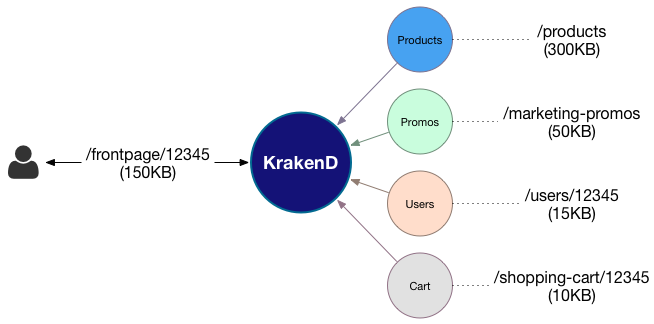

# The KrakenD framework

[](https://travis-ci.org/devopsfaith/krakend) [](https://goreportcard.com/report/github.com/devopsfaith/krakend) [](https://coveralls.io/github/devopsfaith/krakend?branch=master) [](https://godoc.org/github.com/devopsfaith/krakend) [](https://bestpractices.coreinfrastructure.org/projects/3151) [](https://hub.docker.com/r/devopsfaith/krakend/) [](https://gophers.slack.com/messages/krakend)


An open framework to assemble ultra performance API Gateways with middlewares; core service of the [KrakenD API Gateway](http://www.krakend.io).

Looking for the API gateway ready to use?

[Site](http://www.krakend.io/) | [Download](http://www.krakend.io/download/) | [Build](https://github.com/devopsfaith/krakend-ce) | [Documentation](http://www.krakend.io/docs/overview/introduction/) | [Blog](http://www.krakend.io/blog)


## Motivation

Consumers of REST API content (specially in microservices) often query backend services that weren't coded for the UI implementation. This is of course a good practice, but the UI consumers need to do implementations that suffer a lot of complexity and burden with the sizes of their microservices responses.

KrakenD is an **API Gateway** builder and proxy generator that sits between the client and all the source servers, adding a new layer that removes all the complexity to the clients, providing them only the information that the UI needs. KrakenD acts as an **aggregator** of many sources into single endpoints and allows you to group, wrap, transform and shrink responses. Additionally it supports a myriad of middlewares and plugins that allow you to extend the functionality, such as adding Oauth authorization or security layers.

KrakenD not only supports HTTP(S), but because it is a set of generic libraries you can build all type of API Gateways and proxies, including for instance, a RPC gateway.

### Practical Example

A mobile developer needs to construct a single front page that requires data from 4 different calls to their backend services, e.g:

    1) api.store.server/products
    2) api.store.server/marketing-promos
    3) api.users.server/users/{id_user}
    4) api.users.server/shopping-cart/{id_user}

The screen is very simple and the mobile client _only_ needs to retrieve data from 4 different sources, wait for the round trip and then hand pick only a few fields from the response.

What if the mobile could call a single endpoint?

    1) krakend.server/frontpage/{id_user}

That's something KrakenD can do for you. And this is how it would look like:



KrakenD would merge all the data and return only the fields you need (the difference in size in the graph).

Visit the [KrakenD website](http://www.krakend.io) for more information.

## What's in this repository?
The source code on which the [KrakenD](http://www.krakend.io) service core is built on. It is designed to work with your own middleware and extend the functionality by using small, independent, reusable components following the Unix philosophy.

Use this repository if want to **build from source your API Gateway** or if you want to **reuse the components in another application**.

If you need the KrakenD API Gateway [download the binary for your architecture](http://www.krakend.io/download) or [build it yourself](https://github.com/devopsfaith/krakend-ce).


## Library Usage
KrakenD is presented as a **go library** that you can include in your own go application to build a powerful proxy or API gateway. In order to get you started several examples of implementations are included in the `examples` folder.

Of course you will need [golang installed](https://golang.org/doc/install) in your system to compile the code.

A ready to use example:

```go
    package main

    import (
        "flag"
        "log"
        "os"

        "github.com/devopsfaith/krakend/config"
        "github.com/devopsfaith/krakend/logging"
        "github.com/devopsfaith/krakend/proxy"
        "github.com/devopsfaith/krakend/router/gin"
    )

    func main() {
        port := flag.Int("p", 0, "Port of the service")
        logLevel := flag.String("l", "ERROR", "Logging level")
        debug := flag.Bool("d", false, "Enable the debug")
        configFile := flag.String("c", "/etc/krakend/configuration.json", "Path to the configuration filename")
        flag.Parse()

        parser := config.NewParser()
        serviceConfig, err := parser.Parse(*configFile)
        if err != nil {
            log.Fatal("ERROR:", err.Error())
        }
        serviceConfig.Debug = serviceConfig.Debug || *debug
        if *port != 0 {
            serviceConfig.Port = *port
        }

        logger, _ := logging.NewLogger(*logLevel, os.Stdout, "[KRAKEND]")

        routerFactory := gin.DefaultFactory(proxy.DefaultFactory(logger), logger)

        routerFactory.New().Run(serviceConfig)
    }
```

Visit the [framework overview](/docs/OVERVIEW.md) for more details about the components of the KrakenD.

### Examples

The project [KrakenD examples](https://github.com/devopsfaith/krakend-examples)

1. [gin router](https://github.com/devopsfaith/krakend-examples/tree/master/gin/)
2. [mux router](https://github.com/devopsfaith/krakend-examples/tree/master/mux/)
3. [gorilla router](https://github.com/devopsfaith/krakend-examples/tree/master/gorilla/)
4. [negroni middlewares](https://github.com/devopsfaith/krakend-examples/tree/master/negroni/)
5. [dns srv service discovery](https://github.com/devopsfaith/krakend-examples/tree/master/dns/)
6. [jwt middlewares](https://github.com/devopsfaith/krakend-examples/tree/master/jwt/)
7. [httpcache based proxies](https://github.com/devopsfaith/krakend-examples/tree/master/httpcache/)

## Configuration file

[KrakenD config file](/docs/CONFIG.md)

## Benchmarks

Check out the [benchmark results](/docs/BENCHMARKS.md) of several KrakenD components

## Contributing
We are always happy to receive contributions. If you have questions, suggestions, bugs please open an issue.
If you want to submit the code, create the issue and send us a pull request for review.

If you want to contribute on the KrakenD API Gateway binary see the [builder](https://github.com/devopsfaith/krakend-ce)


## Want more?
- Follow the [KrakenD blog](http://www.krakend.io/blog/)
- Follow our [twitter account](https://twitter.com/devopsfaith)
- **Read the [documentation](http://www.krakend.io/docs/overview/introduction/)**

Enjoy the KrakenD!
